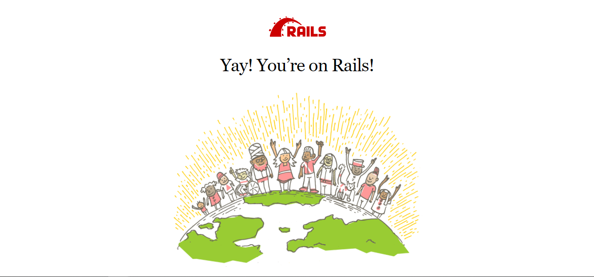

# 概要

初投稿です。
WSL2(Ubuntu)の環境下でDockerを使ったRailsの開発環境の記事が無くて、構築が面倒だったので作りました。

## 作成する開発環境
- Ruby 3.0.2
- Rails 6.1.4
- MySQL 8.0

## ソースコード
ソースコードは下記のとおりです。  
[docker-rails.sh](https://qiita.com/azul915/items/5b7063cbc80192343fc0)

# 使い方

## 前提条件
- WSL2(Ubuntu)
- Docker version 20.10.8以降
- Docker Compose v2.0.0-rc.1以降

## shellの実行

ディレクトリを作成しdocker-rails.shを配置します。

~~~sh
mkdir sample_app
mv docker-rails.sh ./sample_app/
~~~

作成したディレクトリへ移動し、docker-rails.shを実行します。

~~~sh
cd sample_app
bash docker-rails.sh -n {project_name} -p {mysql_password}
~~~

{project_name}は作成するRailsプロジェクトの名前になります。
{mysql_password}は作成するMySQLのrootパスワードになります。 

# ディレクトリ構成

shellを実行すると下記のようなディレクトリ構成が作成されます。

~~~
sample_app    ──|
                ├── README.md
                ├── docker-compose.yml
                ├── docker-rails.sh
                ├── mysql
                │   ├── Dockerfile
                |   ├── .dockerignore
                │   ├── data
                │   ├── docker-entrypoint-initdb.d
                │   └── mysql-confd
                ├── rails
                │   ├── Dockerfile
                |   ├── .dockerignore
                │   └── entrypoint.sh
                └── {project_name}
                    ├── Gemfile
                    ├── Gemfile.lock
                    ├── README.md
                    ├── Rakefile
                    ├── app
                    ├── babel.config.js
                    ├── bin
                    ├── config
                    ├── config.ru
                    ├── db
                    ├── lib
                    ├── log
                    ├── node_modules
                    ├── package.json
                    ├── postcss.config.js
                    ├── public
                    ├── storage
                    ├── test
                    ├── tmp
                    ├── vendor
                    └── yarn.lock
~~~

個人的なこだわりですが、Docker関連のファイルをプロジェクトのソースコードと
同じディレクトリに置きたくないので分けました。
また、rootもあまり使いたくないので、可能な限り使わない形にしました。

# 解説
shellで何をやっているか学びたい人向けに解説していきます。

## shellの作成方針
Mac環境だとDockerの権限などを自動で上手くやってくれますが、 WSL2(Ubuntu)やLinux環境はDocker Deamonが全てrootで動くため権限で引っかかったりします。

このような場合、Rootless Dockerを使うといいのですがWSL2には対応していませんでした。
権限設定など手動で開発環境を構築するのが面倒だったのもあったので、自動構築するshellを作成しました。

## 1.Rails環境用entrypoint.sh,Gemfile,Dockerfileの作成

DockerにRails環境を作成するにあたり、下記のファイルを作成します

- entrypoint.sh
- Gemfile & Gemfile.lock
- Dockerfile

### entrypoint.sh
gosuを使ってroot以外の任意のユーザーでRailsを実行するshellファイルです。
今回は「rails」というユーザーを作成しています。ユーザーIDはLinuxデフォルトの1000を設定しています。

~~~sh
cat <<'EOF' > entrypoint.sh
#!/bin/bash

# Railsの仕様でDocker上だと余分なserver.pidが残り続けてエラーになるため、
# Railsを実行するたびに削除する
rm -f /$project_name/tmp/pids/server.pid

# デフォルトUID&GIDを設定
USER_ID=${LOCAL_UID:-1000}
GROUP_ID=${LOCAL_GID:-1000}

# Railsを実行するユーザーを作成
groupadd -r --gid $GROUP_ID rails
useradd -u $USER_ID -o -m -g $GROUP_ID  -G sudo rails

export HOME=/home/rails

# ユーザーrailsに/usr/srcへの権限を付与
chown -R rails:rails /usr/src

# Railsはsudo以上の権限でないとインストールできないため、
# 作成したユーザーrailsにsudo権限の付与
echo "rails ALL=(ALL) NOPASSWD:ALL" >> /etc/sudoers

# 作成したユーザーrailsでDockerを実行
exec /usr/sbin/gosu rails "$@"
EOF
~~~

こちらはほぼDocker公式のRails Quickstartのとおりです。

### Gemfile & Gemfile.lock
RailsをインストールするためのGemfileです。
Rubyがこれらを参照してRailsをインストールします。

~~~Gemfile
cat <<EOF > Gemfile
source 'https://rubygems.org'
gem 'rails', "~>6.1.4"
EOF
~~~

Gemfile.lockは空で作成します。
こちらもほぼDocker公式のRails Quickstartのとおりです。

### Dockerfile
Rails環境のDockerfileです。
こちらもほぼDocker公式のRails Quickstartのとおりです。

~~~Dockerfile
cat <<EOF > Dockerfile
FROM ruby:3.0.2

ENV LANG C.UTF-8
ENV TZ Asia/Tokyo
WORKDIR $app_root

# gosuなど必要なライブラリのインストール
RUN set -ex && \
    apt-get update -qq && \
    apt-get install -y sudo && \
    : "Install node.js" && \
    curl -sL https://deb.nodesource.com/setup_14.x | sudo -E bash - && \
    apt-get update -qq && \
    apt-get install -y nodejs && \
    : "Install yarn" && \
    curl -sS https://dl.yarnpkg.com/debian/pubkey.gpg | sudo apt-key add - && \
    echo "deb https://dl.yarnpkg.com/debian/ stable main" | sudo tee /etc/apt/sources.list.d/yarn.list && \
    apt-get update -qq && \
    apt-get install -y yarn && \
    apt-get -y install gosu

# ローカルのGemfileおよびGemfile.lockをDockerコンテナにコピー
COPY ./$project_name/Gemfile $app_root/Gemfile
COPY ./$project_name/Gemfile.lock $app_root/Gemfile.lock

# 上記のGemfileを元にDockerコンテナへRailsをインストール
RUN bundle install

# ローカルのentrypoint.shをDockerコンテナへコピーし、
# Dockerコンテナ上で実行できるように権限を付与。
# DcokerコンテナのENTRYPOINTで実行するように設定。
COPY ./rails/entrypoint.sh /usr/bin/entrypoint.sh
RUN chmod +x /usr/bin/entrypoint.sh
ENTRYPOINT ["/usr/bin/entrypoint.sh"]
EXPOSE 3000

CMD ["rails", "server", "-b", "0.0.0.0"]
EOF
~~~

## 2.MySQL用のlocale.gen,my.cnf,init_mysql.sql,Dockerfileを作成

DockerにMySQL環境を作成するにあたり、下記のファイルを作成します

- locale.gen
- my.cnf
- init_mysql.sql
- Dockerfile

### locale.gen,my.cnfの作成
~~~locale.gen
cat <<EOF > locale.gen
ja_JP.UTF-8 UTF-8
EOF
~~~

~~~my.cnf
cat <<EOF > my.cnf
[mysqld]
default_authentication_plugin=mysql_native_password
character-set-server=utf8mb4
collation-server=utf8mb4_general_ci

[client]
default-character-set=utf8mb4
EOF
~~~

locale.genとmy.cnfはmysqlの設定ファイルです。

### init_mysql.sqlの作成

~~~init_mysql.sql
cat <<EOF > init_mysql.sql
# ユーザーが存在しない場合のみ、新規ユーザーを作成するsql
SET @sql_found='SELECT 1 INTO @x';
SET @sql_fresh='GRANT ALL ON *.* TO "$project_name"@''%''';
SELECT COUNT(1) INTO @found_count FROM mysql.user WHERE user='"$project_name"' AND host='%';
SET @sql=IF(@found_count=1,@sql_found,@sql_fresh);
PREPARE s FROM @sql;
EXECUTE s;
DEALLOCATE PREPARE s;
EOF
~~~

init_mysql.sqlはmysqlで最初に実行されるsqlです。
これでmysqlユーザーを作成します。

### Dockerfileの作成

~~~Dockerfile
cat <<EOF > Dockerfile
FROM mysql:8.0

# ユーザーmysqlのUID,GIDをLinuxのUID,GIDと合わせる
RUN groupmod -g 1000 mysql && usermod -u 1000 -g 1000 mysql

# ユーザーrailsにsudo権限を付与します。
# ユーザーrailsにsudo権限を付与していないと、rails db:createコマンドでエラーになります。
RUN echo "rails ALL=(ALL) NOPASSWD:ALL" >> /etc/sudoers

COPY ./mysql/mysql-confd/locale.gen /etc/locale.gen

RUN sed -i 's@archive.ubuntu.com@ftp.jaist.ac.jp/pub/Linux@g' /etc/apt/sources.list
RUN set -ex && \
    apt-get update -qq && \
    : "Install locales" && \
    apt-get install -y --no-install-recommends locales && \
    : "Cleaning..." && \
    apt-get clean && \
    rm -rf /var/lib/apt/lists/* && \
    locale-gen ja_JP.UTF-8
ENV LC_ALL ja_JP.UTF-8
COPY ./mysql/mysql-confd/my.cnf /etc/mysql/conf.d/my.cnf
COPY ./mysql/docker-entrypoint-initdb.d/init_mysql.sql /docker-entrypoint-initdb.d/init_mysql.sql

EOF
~~~

mysqlのDockerファイルです。
MySQL Daemonもrootユーザーで動作するので、
Dockerファイルでsudo権限を付与します。

### プロジェクトの作成&docker-composeの起動
Dockerコンテナでrails newを実行し、プロジェクトを作成します。
その後、docker-compose buildを行うことでbundle installが実行されます。

~~~
docker-compose run --no-deps web rails new . --force --database=mysql
docker-compose build --no-cache
~~~

続いて、下記のコマンドでrailsプロジェクトのdatabase.ymlの内容を書き換えます。

~~~
docker-compose run web /bin/sh -c "sed -ie '0,/password:/ s/password:/password: <%= ENV.fetch('\"'MYSQL_PASSWORD'\"') { '\"'$root_password'\"' } %>/g' ./config/database.yml"
docker-compose run web /bin/sh -c "sed -ie 's/host: localhost/host: <%= ENV.fetch('\"'MYSQL_HOST'\"') { '\"'db'\"' } %>/g' ./config/database.yml"
docker-compose run web /bin/sh -c "sed -ie 's/username: root/username: <%= ENV.fetch('\"'MYSQL_USER'\"') { '\"'$project_name'\"' } %>/g' ./config/database.yml"
docker-compose run web /bin/sh -c "sed -ie 's/username: $project_name/username: <%= ENV.fetch('\"'MYSQL_USER'\"') { '\"'$project_name'\"' } %>/g' ./config/database.yml"
~~~

その後、db:createを実行DBを作成します。

~~~
docker-compose run web rails db:create
~~~

最後にdocker-compose buildをもう一度行なったあとに
コンテナを起動すると、完了です。

~~~
docker-compose build --no-cache
docker-compose up -d
~~~

以上が完了後、localhost:3000へアクセスすると、RailsのTOP画面へ遷移します。

# 参考
参考にした記事は下記のとおりです。作者様からは許可をいただいております。  
[丁寧すぎるDocker-composeによるrails5 + MySQL on Dockerの環境構築(Docker for Mac)](https://qiita.com/azul915/items/5b7063cbc80192343fc0)

